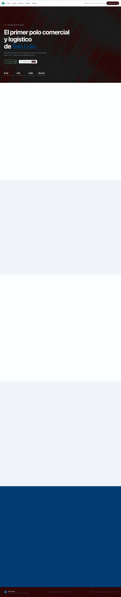
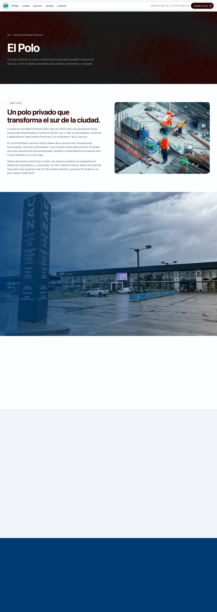
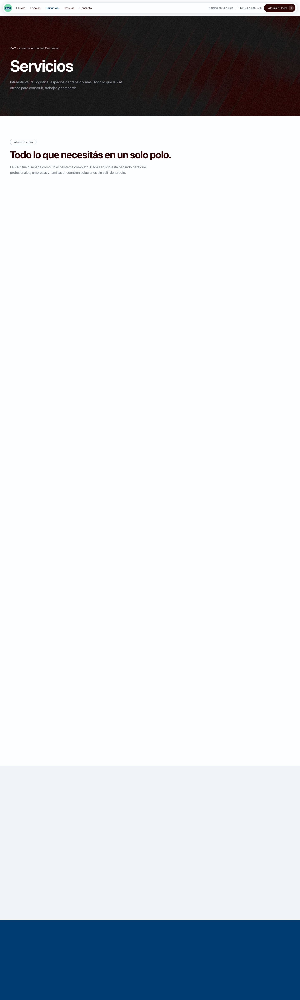
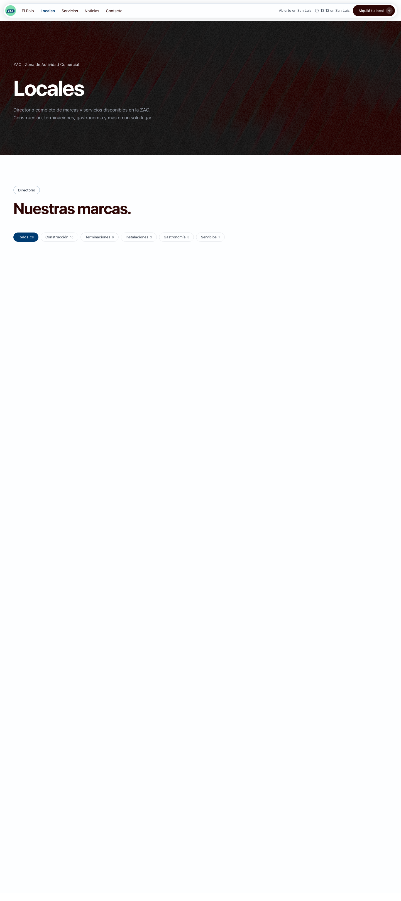
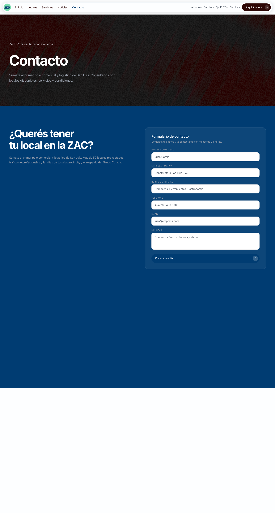

# ZAC — Zona de Actividad Comercial

Landing page multiplataforma para la **Zona de Actividad Comercial (ZAC)**, el primer polo comercial y logístico de San Luis, Argentina. Desarrollado con Vite + React 18 + TypeScript + Tailwind CSS.

## Stack

| Herramienta | Uso |
|-------------|-----|
| **Vite** | Build tool y dev server |
| **React 18** | UI components |
| **TypeScript** | Tipado estático |
| **Tailwind CSS** | Estilos utilitarios |
| **React Router** | Cliente‑side routing con 6 rutas |
| **Leaflet** | Mapas (OpenStreetMap) |
| **shaders/react** | Efectos visuales (Swirl, ChromaFlow, FlutedGlass, FilmGrain) |
| **lucide-react** | Iconos |

## Rutas

| Ruta | Página | Descripción |
|------|--------|-------------|
| `/` | Home | Hero, servicios, directorio de marcas, noticias, contacto y footer |
| `/el-polo` | El Polo | Historia, hitos, estadísticas, opiniones, mapa |
| `/servicios` | Servicios | 6 servicios expandidos con imagen, detalle y destacados |
| `/noticias` | Noticias | 6 artículos reales ordenados por fecha con enlaces a fuentes originales |
| `/locales` | Locales | Directorio con filtros, búsqueda, ordenamiento y mapa interactivo |
| `/contacto` | Contacto | Formulario, datos de contacto, redes, mapa y FAQ |

## Screenshots

### Home


### El Polo


### Servicios


### Noticias


### Locales


### Contacto


## Desarrollo

```bash
# Instalar dependencias
npm install

# Iniciar dev server
npm run dev

# Build producción
npm run build

# Linter
npm run lint
```

## Diseño

- **Paleta**: Primary `#003C72`, Secondary `#7CDEAF`, White `#FDFEFF`, Black `#2D0605`
- **Tipografía**: System UI sans‑serif en todo el sitio
- **Branding**: Logo de ZAC en navbar, favicon personalizado
- **Animaciones**: Scroll reveal, contadores animados, fade transitions entre rutas

## Estructura del proyecto

```
src/
├── App.tsx                  # Router shell + suspenso
├── index.css                # Tailwind + animaciones globales
├── components/              # Componentes reutilizables
│   ├── Navbar.tsx
│   ├── MobileMenu.tsx
│   ├── Footer.tsx
│   ├── Hero.tsx
│   ├── AboutSection.tsx
│   ├── Directory.tsx
│   ├── Services.tsx
│   ├── News.tsx
│   ├── ContactSection.tsx
│   ├── Map.tsx
│   ├── StoreMap.tsx
│   ├── LocalesCard.tsx
│   ├── BrandCard.tsx
│   ├── StatCounter.tsx
│   ├── TextRollButton.tsx
│   ├── BackToTop.tsx
│   └── Reveal.tsx
├── pages/                   # Páginas (lazy‑loaded)
│   ├── Home.tsx
│   ├── AboutPage.tsx
│   ├── ServicesPage.tsx
│   ├── NewsPage.tsx
│   ├── LocalesPage.tsx
│   ├── ContactPage.tsx
│   └── NotFound.tsx
├── data/                    # Datos estáticos
│   ├── brands.ts (22 marcas, 6 categorías, tags)
│   ├── services.ts (6 servicios)
│   ├── news.ts (6 artículos reales)
│   ├── reviews.ts (6 opiniones)
│   └── stats.ts (estadísticas)
└── hooks/
    ├── useCountUp.ts
    ├── useReveal.ts
    └── useSanLuisTime.ts
```
